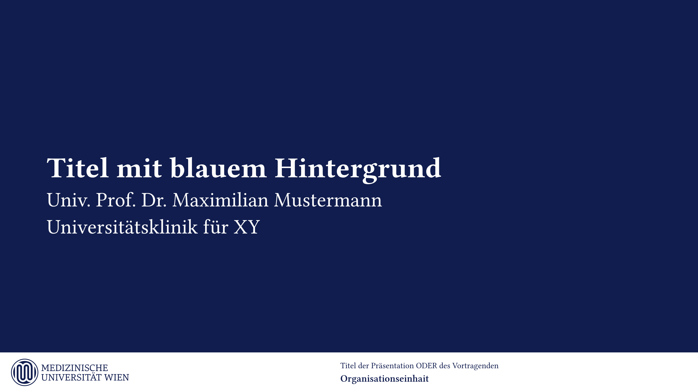
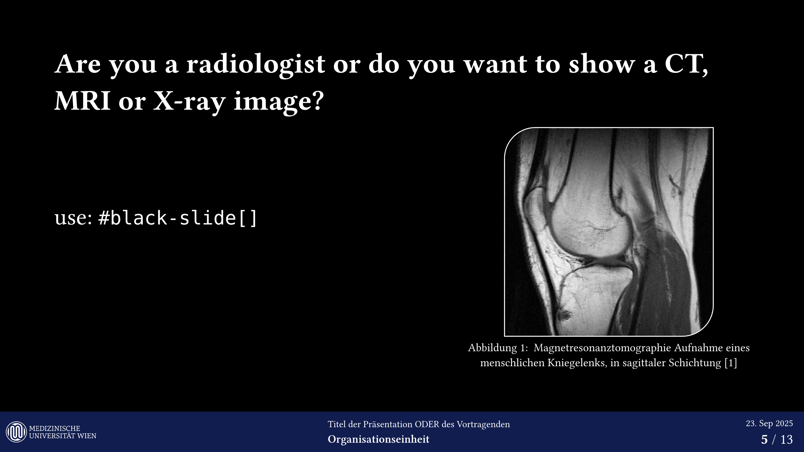

# `muw-community-templates`
## Medical University of Vienna

This repository hosts community maintained unofficial templates for the Medical University of Vienna. Currently, it includes a presentation template built on the [`polylux`](https://typst.app/universe/package/polylux/) beamer style engine for Typst.

## Contents

* **`colors.typ`**: Defines the official color scheme according to the university corporate design.
* **`presentation.typ`**: Main presentation template implementing the university branding and layout guidelines.

## Features

* **Colors**. All corporate colors are defined in `colors.typ`.
* **Logos**. White and blue SVG versions of the university logo are included for footer rendering, adapting to background color.
* **Slides**  
  * `slide`: Base slide that calls `polylux.slide`.  
  * `color-slide`: Custom background and font colors.  
  * `black-slide`: Black background with white font (for x-ray, ct, etc.).  
  * `blue-slide`: Dark blue background with white text (titlepage).  
* **Footer**  
  * Left: MedUni Wien logo with adaptive color.  
  * Center: Presentation title and organisational unit.  
  * Right: Page number, optionally formatted as a percentage, and the date if required.  
* **Layout**  
  * Rounded corner boxes via `muw-box`.  
  * Customisable `slides(...)` block with metadata, including `title`, `series`, `orga`, `author`, `klinik`, and `email`.  
  * Optional table of contents and user defined page numbering function.  

## Example Usage

The easiest way is to search for this template in typst.app webapp and select it,
which will create a template for you in the project.

or see:
- [src/presentation.typ](./src/presentation.typ)
- [src/template/main.typ](./src/template/main.typ)

> [!WARNING]
>
> As the correct fonts are not freely available, they are not supported in this template.
>
> Locally, Typst uses your installed system fonts or embedded fonts in the CLI, which are Libertinus Serif, New Computer Modern,
> New Computer Modern Math, and DejaVu Sans Mono. In addition, you can use the `--font-path` argument or `TYPST_FONT_PATHS` environment
> variable to add directories that should be scanned for fonts. The priority is: `--font-paths` > system fonts > embedded fonts.
> Run typst fonts to see the fonts that Typst has discovered on your system. Note that you can pass the `--ignore-system-fonts` parameter
> to the CLI to ensure Typst won't search for system fonts.
>
> see: https://typst.app/docs/reference/text/text/
>
>
> - Primärschrift: Danton
> - Systemschrift: Georgia
> - Sekundärschrift: Akkurat Pro
> - Systemschrift: Lucida Sans
>

refs:
- https://www.meduniwien.ac.at/web/studierende/service-center/meduni-wien-vorlagen/
- https://typst.app/
- https://github.com/typst/packages/tree/main/packages/preview/
- https://github.com/typst/packages/blob/main/docs/manifest.md

